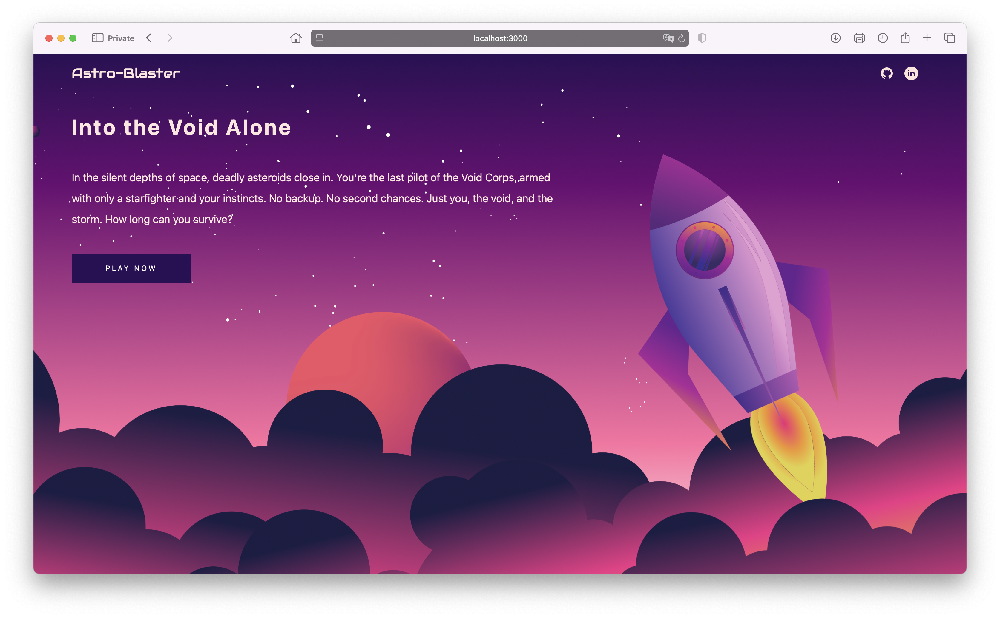
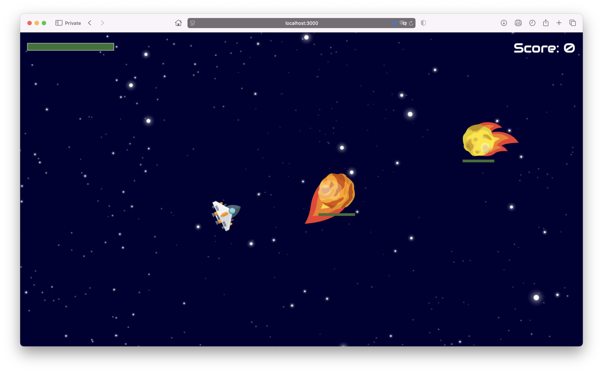
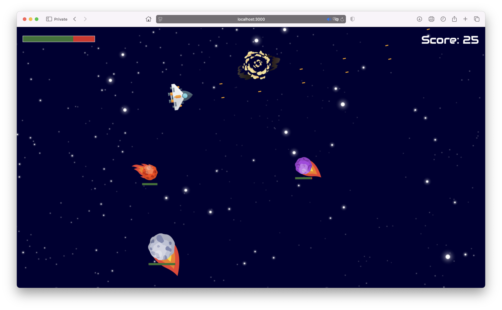

# 🚀 Astro-Blaster

**Astro-Blaster** is a browser-based arcade game where you pilot a rocket-powered starship and fight off incoming meteorites in deep space. Inspired by the classic game **Asteroids**, this version is built with modern web technologies: **TypeScript**, **SCSS**, **HTML**, and **Gulp** for task automation.

---

## 🚀 Live Demo

Try it now: [Astro-Blaster Live](https://your-demo-url.com)

---

## 🕹️ Gameplay

Fly through space, avoid collisions, and shoot meteorites to break them apart. As you destroy large rocks, they split into smaller ones, increasing the intensity of the action.

### ✨ Features

- Classic arcade-style gameplay with a modern twist
- WASD controls for smooth navigation
- Spacebar shooting with meteor splitting
- Animated effects and responsive canvas rendering
- Modular TypeScript codebase
- SCSS for clean and maintainable styling
- Gulp-powered build process

---

## 🎮 Controls

| Key     | Action        |
|---------|---------------|
| **W**   | Accelerate    |
| **A**   | Rotate Left   |
| **D**   | Rotate Right  |
| **Space** | Shoot       |

---

## 🛠️ Built With

- **TypeScript** – For game logic and modular structure
- **SCSS** – For styling and visual effects
- **HTML5** – For game layout and canvas
- **Gulp** – For task automation and building assets

---

## 📦 Getting Started

### ✅ Prerequisites

- [Node.js](https://nodejs.org/) (v14 or newer)
- npm (Node Package Manager)

### 🧰 Installation

Install the dependencies:

```bash
  npm install
```

# Asteroids Reimagined

## 🔧 Scripts

| Command         | Description                   |
|-----------------|-------------------------------|
| `npm run start` | Starts the dev server         |
| `npm run build` | Builds the project using Gulp |

> **Note:** Make sure Gulp is installed globally if needed:  
> `npm install --global gulp-cli`

---

## 📁 Project Structure

```bash
    /src
        /game         # TypeScript game modules
        /styles       # SCSS stylesheets
        /assets       # Images, sounds, etc.
        /website      # Scripts for the web page
        index.html    # Main HTML file
        main.ts       # Game entry script
    
    /gulpfile.js     # Gulp build tasks
    /package.json    # Project metadata and scripts
```

---

## 🎨 Gameplay Screenshots




---

## 🧠 Inspiration
A modern reimagining of the legendary **Asteroids game**, rebuilt from scratch using modern frontend tools and development practices.  
Also features some sound effects inspired by and sourced from **Terraria**.
